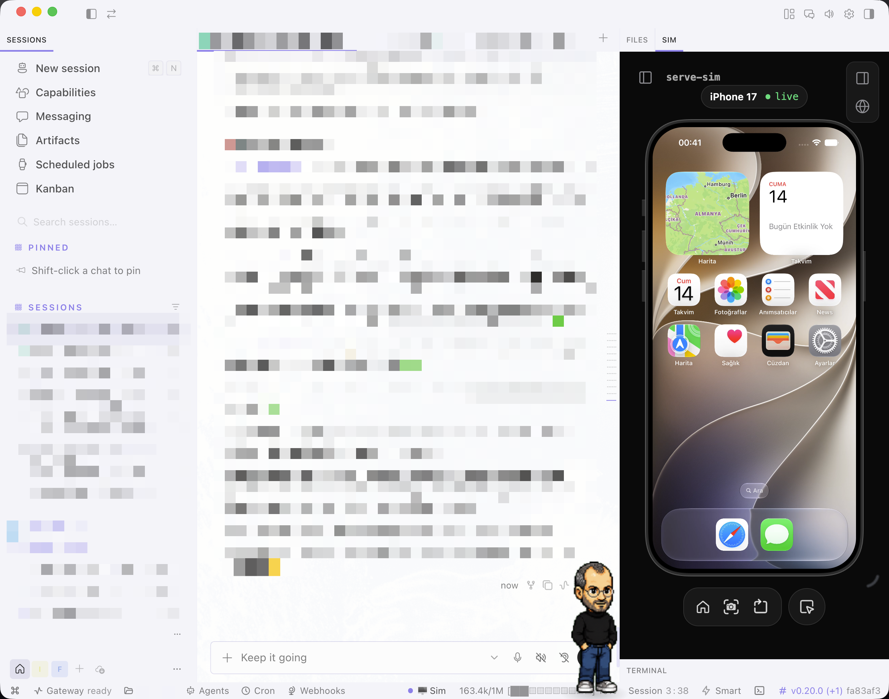

# hermes-serve-sim

**Run your iOS Simulator live inside Hermes Desktop.**

[](LICENSE)
[](https://www.apple.com/macos/)
[](https://hermes-agent.nousresearch.com)
[](https://www.npmjs.com/package/serve-sim)

A [Hermes Desktop](https://hermes-agent.nousresearch.com) plugin that pairs with
[serve-sim](https://www.npmjs.com/package/serve-sim) to stream your booted iOS
Simulator straight into the app — no separate windows, no context switching.



## ✨ Features

- 🖥 **Statusbar chip** — green dot when the sim/serve-sim is up, dropdown menu
  to turn it on/off and check status.
- 🧩 **Persistent "Sim" pane** — a live, interactive iframe of the simulator,
  docked to the right edge of the workspace. When serve-sim is off, the pane
  shows a friendly empty state with a turn-on button.
- ⌘K **commands** — `Simtest: Turn On`, `Simtest: Turn Off`, `Simtest: Status`.
- 🔌 **Minimal backend** — a small FastAPI router that only runs fixed
  commands (`simctl` / the `simtest` script); no user input ever reaches a
  shell.

## Requirements

- macOS with Xcode (and an iPhone simulator runtime)
- Node.js (`npx serve-sim` is used to start the stream)
- Hermes Desktop app (plugins load at runtime, no rebuild)

## Quickstart

```bash
# 1. Clone or download this repo
git clone https://github.com/tkl-1/hermes-serve-sim.git
cd hermes-serve-sim

# 2. Copy files to their Hermes homes (keep the folder name `simtest`)
mkdir -p ~/.hermes/desktop-plugins/simtest
cp plugin/plugin.js ~/.hermes/desktop-plugins/simtest/plugin.js

mkdir -p ~/.hermes/plugins/simtest/dashboard
cp backend/plugin_api.py ~/.hermes/plugins/simtest/dashboard/plugin_api.py

cp scripts/simtest ~/.local/bin/simtest
chmod +x ~/.local/bin/simtest
```

3. Add `simtest` to `plugins.enabled` in `~/.hermes/config.yaml`:

   ```yaml
   plugins:
     enabled: [simtest]
   ```

4. Restart the Hermes gateway so the backend router is mounted:

   ```bash
   hermes gateway restart
   ```

5. In the desktop app: `⌘K` → **Reload desktop plugins**.

## Usage

- Click the **🖥 Sim** chip in the status bar → **Turn Sim On**. The script
  boots the simulator, opens Simulator.app, and starts `serve-sim` on
  `http://localhost:3200` in the background.
- The **Sim** pane (right edge of the workspace) shows the live stream. It is
  interactive — you can tap the simulator right from the pane.
- **Turn Sim Off** stops serve-sim; the simulator stays booted with your last
  build installed.

## Configuration

Everything is optional; sensible defaults apply.

| Env var | Default | Meaning |
|---|---|---|
| `SIMTEST_UDID` | first available iPhone | Simulator device UDID |
| `SIMTEST_PORT` | `3200` | serve-sim port |
| `SIMTEST_HOST` | `127.0.0.1` | serve-sim bind address — loopback only by default; set `0.0.0.0` explicitly for LAN/tunnel access |
| `SIMTEST_PIN` | `0.1.45` | serve-sim version run via npx (pinned, not latest) |
| `SIMTEST_SCRIPT` | `~/.local/bin/simtest` | path to the CLI helper (backend only) |
| `SIMTEST_DEVELOPER_DIR` | system toolchain | e.g. `/Applications/Xcode-beta.app/Contents/Developer` if you use a beta Xcode |

> Note: the statusbar chip and the pane poll `/status` every 10 seconds. The
> backend waits up to 90s for `simtest on` (first boot + npx install can be
> slow); the CLI helper itself waits up to 45s for serve-sim to bind the port.

## Security

> [!IMPORTANT]
> `serve-sim` has **no authentication** — anyone who can reach it can watch and
> control your simulator. The script binds to `127.0.0.1` unless you explicitly
> opt into `SIMTEST_HOST=0.0.0.0` (e.g. for tunneling). **Bind to loopback, then
> tunnel if you need remote access.**

- **Loopback only by default.** The backend only accepts `localhost`/`127.0.0.1`
  hosts and local origins (`http://localhost*`, `http://127.0.0.1*`, `file://`,
  `app://`, `null`). Requests with a foreign `Origin` header get 403. This
  rejects cross-origin browser POSTs but is **not a substitute for
  authentication** — a sandboxed iframe or `data:` URL can send `Origin: null`.
- **PID safety.** `simtest off` verifies the pidfile's process is actually
  `npm`/`node` before killing it, then cleans up any remaining listener on the
  port by PID — it never pattern-kills unrelated processes.
- **Process-group isolation.** `simtest on` starts serve-sim in its own process
  group when `setsid` is available; on failure or timeout the entire tree is
  killed, leaving no orphaned `npx`/`node` children.
- **Fixed commands only.** The backend executes fixed command constants
  (`simctl`, the `simtest` script) — no user-controlled strings ever reach a
  shell, and `subprocess` is always called with an argument list (no
  `shell=True`).
- The pane embeds `http://localhost:3200`.

## How it works

```
Hermes Desktop UI (plugin.js)
  ↓ REST
Hermes FastAPI backend (plugin_api.py)
  ↓ subprocess
simtest CLI (bash)
  ↓
xcrun simctl + serve-sim (npx)
  ↓
iOS Simulator stream → http://localhost:3200
```

## Contributing

Issues and PRs welcome. Keep the plugin id as `simtest` — the folder name must
match it.

## License

MIT — see [LICENSE](LICENSE).
